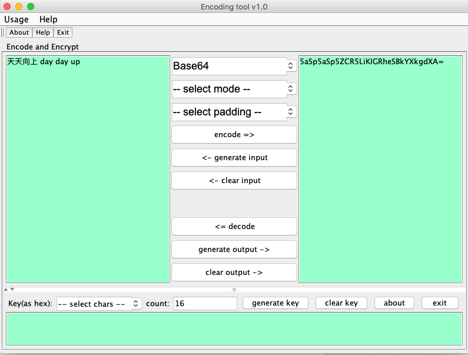

# Introduction

It is a small tool to convert encoding, which I wrote long long time ago.

It's useful to me and someone may need it too, so I extract it from old code repo and build it to a standalone tool.

Please star it if you like it :)

You can raise issue to me if you want new functions.

Thanks, 
Walter

# How to use it?

1. clone this repo

2. cd encoding_helper

3. compile and package, JDK is required

    mvn clean compile assembly:single
    
4. run it

    start.sh or start.bat    
